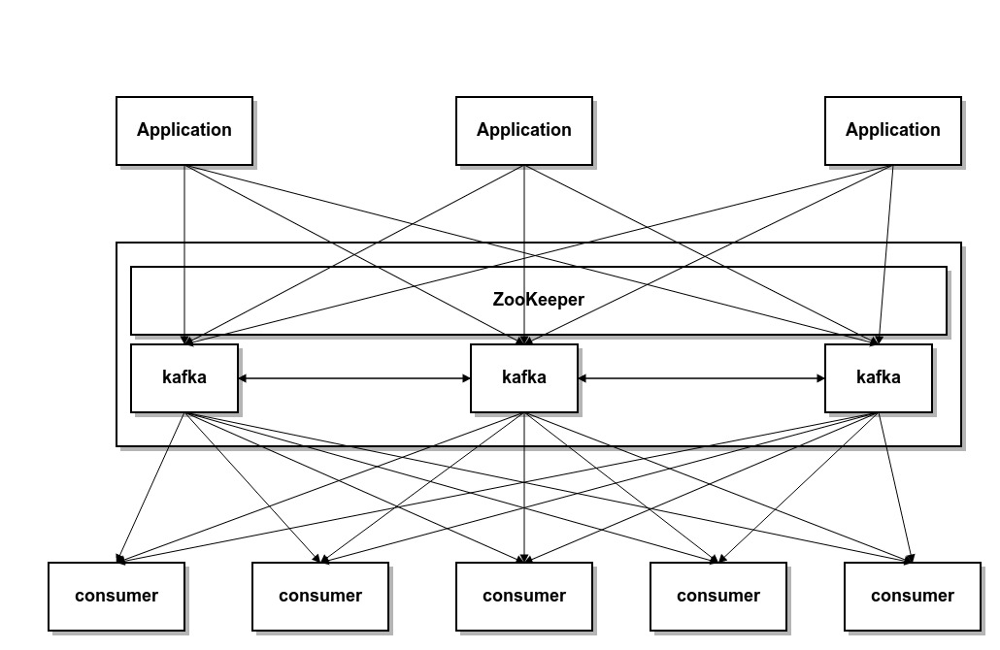

# Apache Kafka
분산 메세징 시스템이다.

대용량 실시간 로그처리에 특화된 아키텍처로 개발되었다.

아직 어떻게 적용할지는 잘 모르겠다.

## Kafka 구성요소
producer, consumer, broker로 구성되어있다.

producer는 메세지를 broker에게 전달하는 역할이며 ,

broker는 메세지를 담아서 보관하며 ,

consumer는 자신이 처리할수 있는 메세지를 broker에게 직접 가져와 처리한다.

이때 broker는 클러스터로 구성되어있고, 하나의 broker라도 클러스터로 동작한다.

이 broker에 대한 분산처리는 Apache ZooKeeper가 담당한다.

굉장히 복잡하다.

나중에 상세한 설명을 더 추가

## Kafka 특징
* 단순한 TCP기반의 프로토콜이기 때문에 오버헤드가 적다.
* 메세지가 메모리에 저장되지 않고 파일시스템에 유지된다.
    * 데이터의 영속성이 보장되며, 파일 시스템에 메세지를 유지하기 때문에 메세지가 많아져도 성능부하가 적다.
    * 주기적인 Batch작업에도 사용이 가능하다.
    * consumer에 의해 처리된 작업도 파일시스템에 유지하다가 설정정보에 따라 삭제한다. 이 방법의 장점은 메세지 처리 도중에 문제가 생기면
    consumer에서 처음부터 rewrite할수 있기 때문이다.
* 기존의 메세지 큐는 broker가 consumer에게 push하는 방법이었다면, kafka는 push가 아닌 consumer가 pull로 메세지를 받아온다.
    이 장점은 push가 아니기 때문에 consumer가 자신의 성능을 최대로 발휘할 정도로만 메세지를 가져와 처리하고, 부하가 걸리지 않게 처리할수 있다는 장점이다.